# WPF アプリケーションの「コード化されたUIテスト (Coded UI Test) 」の作り方 ～ UIのテスト駆動開発とUIMapの保守

単体テストと同様に「コード化されたUIテスト(Coded UI Test)」をどのように作成するか？はプロジェクトを進める上で非常に重要です。「シナリオテスト」は「要件」に応じて事前に準備されるべきですが、UIMap はUI実装が完了しなければ作成出来ません。 この問題を解決するサンプルを用意しました。このサンプルを使うことで、ある程度開発が進むまでUIMap を使わずにテスト駆動で UI を開発する方法と、アプリが完成に近づき「シナリオテスト」のテストケースが十分にそろった頃に、UIMap を使った完全なテストを作成する方法をイメージできます。

## 概要
単体テストと同様に「コード化されたUIテスト(Coded UI Test)」をどのように作成するか？決定する事はプロジェクトを進める上で非常に重要です。

単体テストがクラスライブラリのメソッドを検証するのに対し、コード化されたUIテストはユーザーインターフェイスの動作を検証します。UI がユーザーコントロールとして独立してテスト出来るようになっていれば、いわゆる「単体テスト」として位置づけることができますが、一般的には画面全体の動作を検証する、いわゆる「シナリオテスト」と位置づけられるでしょう。

一般的に「シナリオテスト」は開発の実装よりも前工程の「要件」と関連して、「要件をどれだけ網羅しているか？」という観点で準備されるべきものですが、Visual Studio のコード化されたUIテストは、UIの実装が完了しなければ作成することが出来ません。テストの設計を開発より先行して行うためには、コード化されたUIテストで何ができるのか？を理解する必要があります。また、テストの設計のみを先行して開始できても、いわゆる「テストファースト」「テスト駆動」で実装を進めることが出来ません。

この問題を解決するために、「UIMap を使用した、コード化されたUIテストの基本的な作り方」と「UIMap を使用しないテストの作成方法」をサンプルとしてまとめました。

サンプルには、画面遷移してアイテムをリストに追加する WPF アプリケーションが含まれています。

このサンプルを使うことで、どのように UIMap を使用してコード化されたUIテストを作成するか？手軽に確認することが出来るため、テストの設計を進める上でのイメージを持つことが出来ます。Visual Studio 2013 Premium/Ultimate を使ってすぐにコード化されたUIテストが動作するか？アニメーションを再生するように動作を確認することが出来ます。

また、このサンプルでは UIMap を使用しないテストの作成方法を紹介しています。この方法では、(XAML での x:Name があらかじめ決定している必要がありますが）、UIを実装する前にテストコードを実装することが出来ます。これによってテスト駆動開発で UI を開発することが出来ます。通常は F5 ボタンを押して WPF アプリをデバッグ起動して手動でテストしているところを、代わりに、何度でも同じテストケースでテストしながらUIを開発することが出来ます。

この方法は UIMap を作成しないので変更に強く、ある程度開発が進むまでは、UIMap を使わずにテスト駆動で UI を開発し、アプリが完成に近づき、「シナリオテスト」のテストケースが十分にそろった頃に、UIMap を使った完全なテストに切り替える（共存させる）事が出来ます。

## サンプルの使い方
サンプルはテスト対象の WPF アプリ プロジェクト (SampleWpfApp) と、コード化されたUIテストのサンプルプロジェクト (SampleWpfApp.Test) の二つで構成されています。

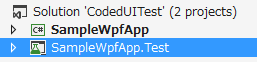

Visual Studio 2013 Premium/Ultimate でソリューションを開き、[ テスト(S) > 実行(R) > 全てのテスト(A) ] を実行してください。

（静かに実行される 単体テスト と違って）ここでサンプルアプリが起動してテストが実施されます。マウスやキーボードを操作せずに、デモアニメーションを見るかのように、テストが完了するのを待ちましょう。


- [動画で確認](https://youtu.be/JDW1ytlJRzU)

[ テスト(S) > ウィンドウ(W) > テスト エクスプローラー(T) ] にテスト結果が表示されます。全ての結果が成功（緑のチェックマークのアイコン）になれば動作成功です。（ただし一部のテストは SampleWpfApp を手動で先に起動しておかないと失敗するようになっています）

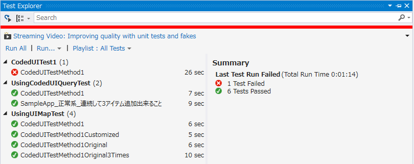

テスト結果を選択して [出力] を押すと、標準出力に詳細な情報が出力されているのが確認できます。

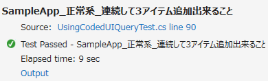

このテストでは、ボタンのクリックやテキストの入力など、テストされた操作が全て表示されています。テキストの期待値と結果や、見つかった TextBlock の個数などが全て表示されています。

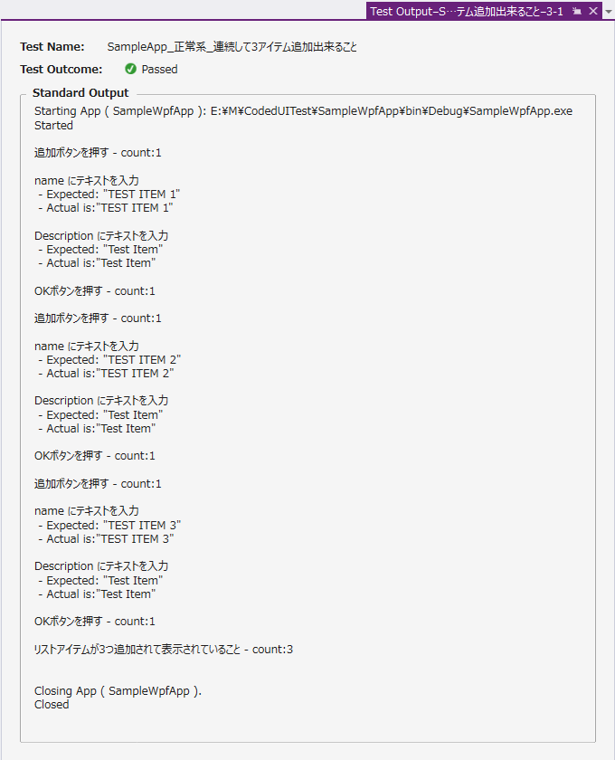

一見冗長に感じるかもしれませんが、実際に、大量の「シナリオテスト」をコード化されたUIテストで実装し開発の度に保守を続けるためには、最低限これらの情報を出力しておかないと、いざテストが失敗になった時になぜ失敗になったのか？すぐにはわかりません。

この出力を簡単にするためのライブラリをサンプルでは使用しています。

## サンプルの説明
ソリューションに含まれるサンプルの内容は次の通りです。

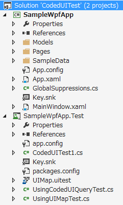

### SampleWpfApp
データバインドとフレーム・ページ遷移を使用した WPF アプリケーションです。

 - HOME 画面にアイテムの一覧が表示されます。 
 - 最初はアイテムがありません。 
 - Add ボタンを押して、EDIT 画面に遷移するとアイテムを追加出来ます。 
 - データを保存する機能は無いため、再起動するたびにアイテムは空になります。 

### SampleWpfApp.Test CodedUITest1.cs
UIMap を使用して作成した「コード化されたUIテスト」のサンプルです。
 - 「録画」機能によって実際にアプリを操作して作成しました。 
 - UIMap.uitest ファイルと関連して動作します。 
 - アプリを起動する機能がないため、SampleWpfApp を先に起動してからテストします。 
 - UIMap を使用し、高機能で小規模な変更に強いです。UIが完成してからテストを実装します。 
 
#### C#
```cs
[TestMethod] 
public void CodedUITestMethod1() { 
    // To generate code for this test, select "Generate Code for Coded UI Test" from the shortcut menu and select one of the menu items. 
 
    this.UIMap.AddNewItem1(); 
    this.UIMap.AssertListItemCount1(); 
} 
```
 
###  SampleWpfApp.Test UsingUIMapTest.cs
UIMap を使用して作成し、カスタマイズした「コード化されたUIテスト」のサンプルです。
 - CodedUITest1.cs の内容をカスタマイズしたものです。 
 - UIMap.uitest ファイルと関連して動作します。 
 - CodedUITestPlus, CodedUIQuery という NuGet ライブラリを使用します。 
 - UIMap.cs にカスタマイズされたテストコードが追加されてあり、それを使用します。 
 - SampleWpfApp アプリが自動的に起動されます。 
 - UIMap を使用し、高機能で小規模な変更に強いです。UIが完成してからテストを実装します。 
 
#### C#
```cs
[TestMethod] 
public void CodedUITestMethod1() { 
    using (var app = App.LaunchSolutionProject(this, "SampleWpfApp") ) { 
 
        OperationAssert.TextIs( 
            "最初に 0.5 秒以内にホーム画面が表示されること", 
            "HOME", 
            app.Element.Sleep( TimeSpan.FromSeconds( 0.5 ) ).Find( "(pageTitle)" ) ); 
 
        this.UIMap.AddNewItem1(); 
        this.UIMap.AssertListItemCount1(); 
    } // end using 
} // end function 
```

### SampleWpfApp.Test UsingCodedUIQueryTest.cs
UIMap を使用しないで作成した「コード化されたUIテスト」のサンプルです。
 - CodedUITestPlus, CodedUIQuery という NuGet ライブラリを使用します。 
 - SampleWpfApp アプリが自動的に起動されます。 
 - UIMap を使用しないため、大規模な変更に強く、テスト駆動開発が可能です。UIMap や UITestControl にしかない強力な機能は使えないため注意が必要です。 

#### C#
```cs
[TestMethod()] 
public void SampleApp_正常系_連続して3アイテム追加出来ること() { 
 
    using (var app = App.LaunchSolutionProject( this, "SampleWpfApp" )) { 
 
        var counter = 0; 
        Func<string> getCountText = () => " " + (counter +=1).ToString(); 
 
        Action<string> execute = (itemName) => 
        { 
            OperationAssert.IsSingle( "追加ボタンを押す", app.Element.WaitForFind( "(appBarAddButton)", TimeSpan.FromSeconds( 0.5 ) ).MoveMouseTo().Click()); 
            OperationAssert.TextIs( "name にテキストを入力", itemName, app.Element.WaitForFind( "(name)", TimeSpan.FromSeconds( 0.5 ) ).MoveMouseTo().SetText( "" ).InputText( itemName ) ); 
            OperationAssert.TextIs( "Description にテキストを入力", "Test Item", app.Element.Find( "(Description)" ).MoveMouseTo().SetText( "" ).InputText( "Test Item" ) ); 
            OperationAssert.IsSingle( "OKボタンを押す", app.Element.Find( "(OKButton)" ).MoveMouseTo().Click() ); 
        }; 
 
        execute( "TEST ITEM" + getCountText() ); 
        execute( "TEST ITEM" + getCountText() ); 
        execute( "TEST ITEM" + getCountText() ); 
 
        OperationAssert.CountIs( 
            "リストアイテムが3つ追加されて表示されていること", 
            3, 
            app.Element.Find( "(mainList)" ).MoveMouseTo().Children( "{ListViewItem}" ) ); 
 
        // 最後に目視のため 0.5 秒待ちます。 
        app.Element.Sleep( TimeSpan.FromSeconds( 0.5 ) ).Count(); 
 
    } // end using 
 
 
} // end function
```

### UIMap を使ったテストの作り方
コード化されたUIテストのプロジェクトを新規作成するとき、あるいはテストを追加するときに、録画機能を使用するか？確認するダイアログが表示されるため、これで録画機能を使用します。

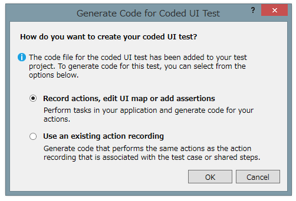

録画用のツールウィンドウが起動したら、一番左の録画ボタンで「録画」を開始、一番右の「Generate Code」ボタンでその間の操作を UIMap.uitest ファイルへの保存すること出来ます。

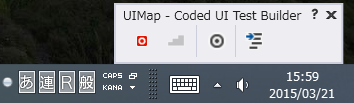

録画ボタンを押すより前に対象のアプリを起動し、録画ボタンを押してから、操作を行い、最後に「Generate Code」ボタンを押して保存します。その間の操作はおおよそ全て記録されてしまうので間違って操作しないために、テストシナリオを事前に用意して起きましょう（画面に表示するか印刷しておきます）。

検証を追加するには、真ん中の二重丸のボタンにカーソルを合わせて、検証したい TextBlock や Textbox の上までマウス左ボタンを押したままドラッグして、ボタンを放します。

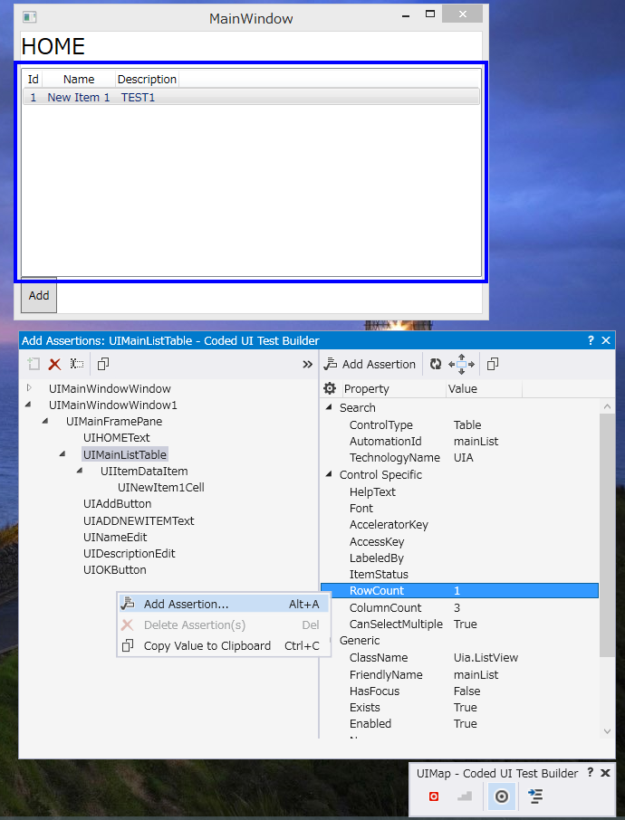

「Add Assertions 」ウィンドウの検証したい項目を選択して、右クリックメニューの「Add Assertions...」を押すと、検証方法を聞かれるので入力します。

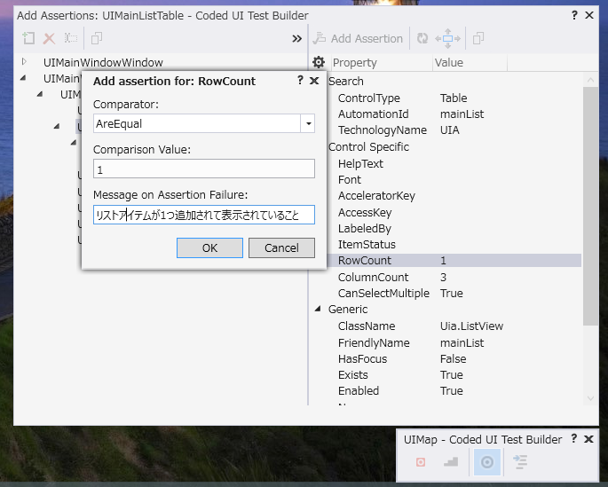

この例では リストに行が１つしかないことを確認しています。RowCount が AreEqual で 1 と同じ事を確認するように設定しています。

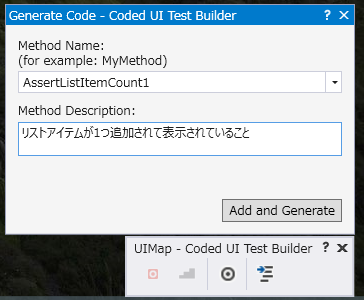

検証の追加も最後に「Genelete Code」ボタンを押して UIMap.uitest ファイルに追加します。

## XAML x:Name 変更後の UIMap の修正方法
SampleWpfApp の XAML を変更した場合、UIMap によるテストは動作しなくなります。

例えば、EditPage.xaml の Description を DescriptionBox に変更してビルドしてください。テストが成功しなくなります。

CodedUITestPlus を使用したテストは、x:Name を変更するだけで対応出来ます。
 
#### C#
```cs
OperationAssert.TextIs( "Description にテキストを入力", "Test Item", app.Element.Find( "(DescriptionBox)" ).MoveMouseTo().SetText( "" ).InputText( "Test Item" ) ); 
```

UIMap では、プロパティの Search Properties の AutomationId を変更します。（Friendly Name ではない点に注意）

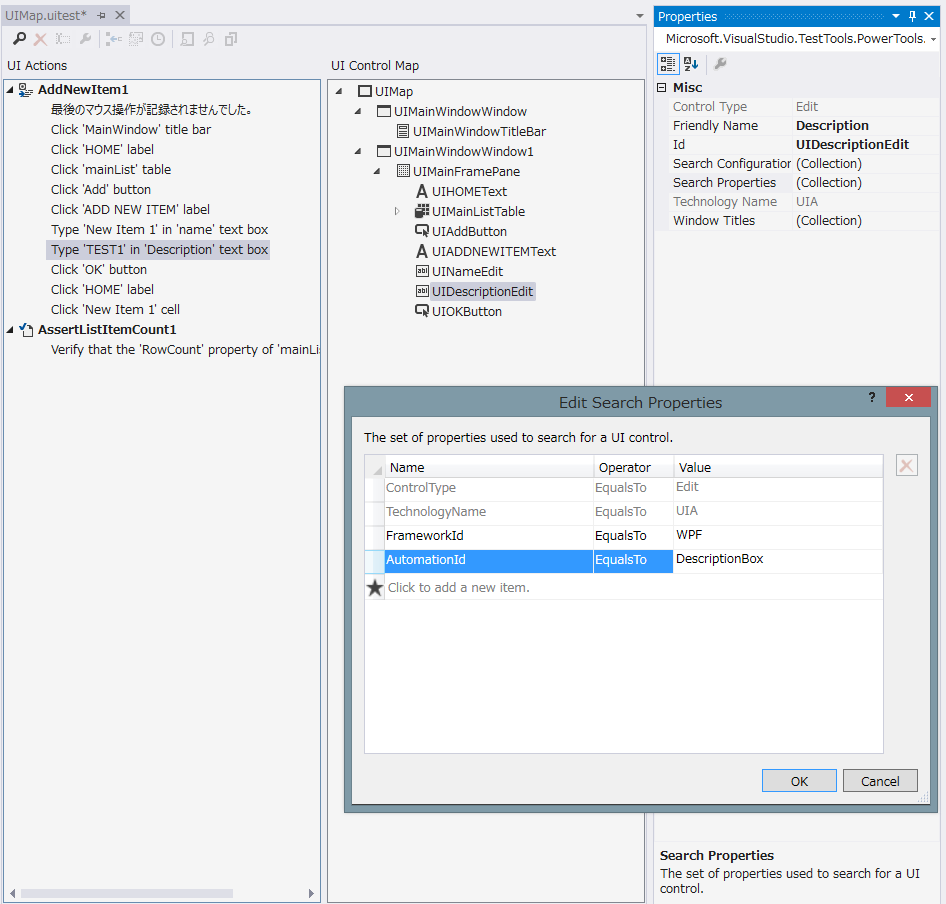 

簡単な変更の場合は UIMap での変更が全てのテストで使用されるので、修正は容易です。

XAML の構造が大幅に変更した場合は、もう一度録画ツールを使って、UIMap を作り直します。UIが完成するまでは CodedUITestPlus/CodesUIQuery でテストを作成し、テスト駆動開発し、完成後は UIMap で大規模なシナリオテストをするのが良いでしょう。

## UIMap でのテストのカスタマイズ方法
UIMap の UI Actions で操作を右クリックして表示される「Move code to UIMap.cs」を実行すると、UIMap.Designer.cs にあったコードが最初は空だった  UIMap.cs に移動して、自由に編集可能になります。

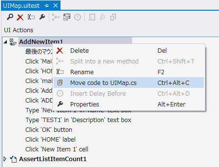

検証（Assersion）は UIMap.cs に移動できません。UI Control Map も変更出来ません。C# コードに変換してエディタと切り離せるのは UI Actions に表示されている「操作」だけです。

一度移動すると UIMap には戻せません。サンプルでは一度移動してカスタマイズしたものと、移動する前のものを両方含めています。

## ステップアップのための練習課題
 - 実際の開発をイメージして、テストが失敗するように SampleWpfApp を変更してみましょう。x:Name を変更する以外に、例えば編集画面のバリデーション（入力必須によるエラー表示）や、保存確認ページを追加してみましょう。 
 - CodedUITestPlus/CodetUIQuery を使ったテストで、アプリの変更に対応しましょう 
 - UIMap を使ったテストで、アプリの変更に対応しましょう 
 - 「シナリオテスト」をイメージして、UIMapを使ったテストを量産してみましょう。 
 - CodedUITestPlus　には「メモ帳を起動する機能」と「クリップボードにテキストをコピーする機能」があります。SampleWpfApp に「内容をコピー」するボタンと機能を追加し、その内容を検証しましょう。また、メモ帳を起動して貼り付けるテストも追加してみましょう。 